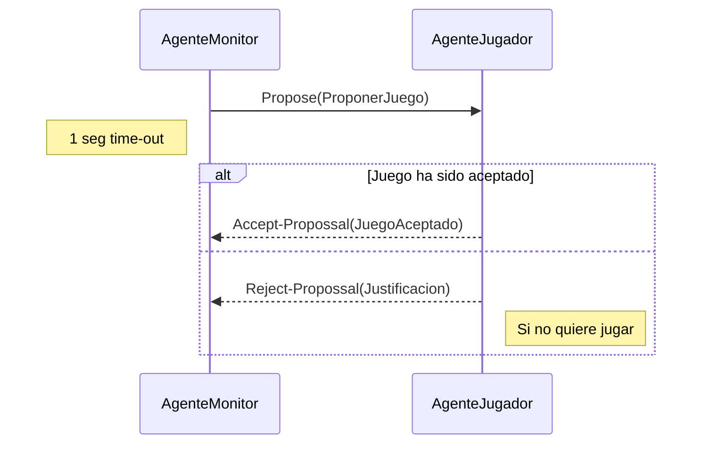
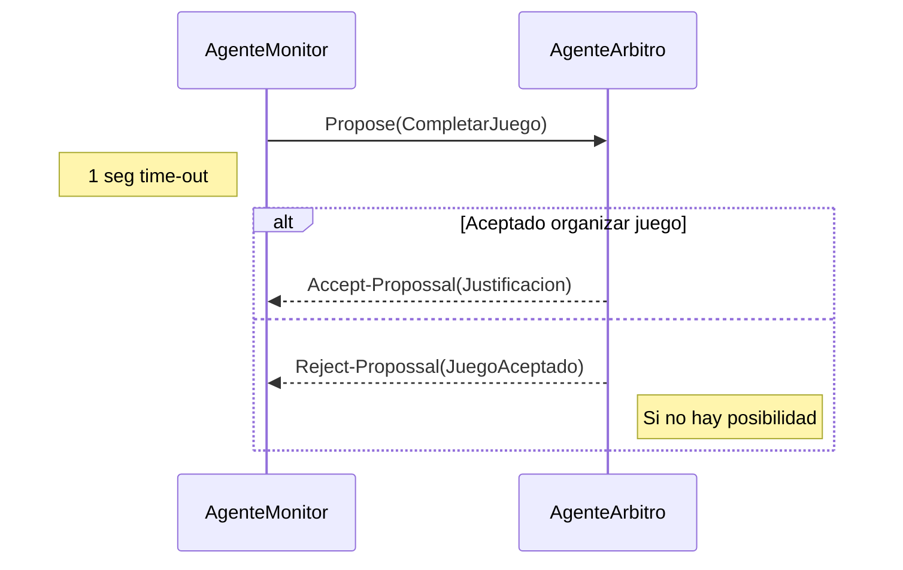
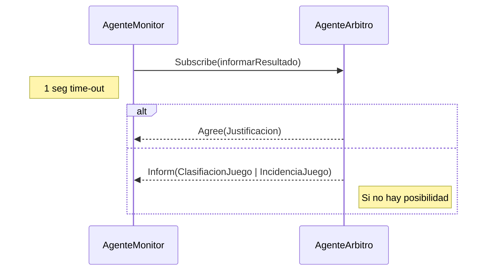
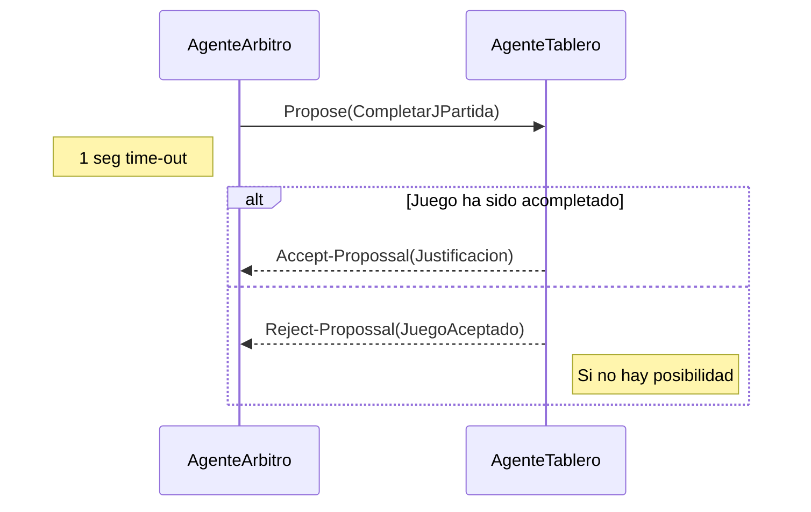
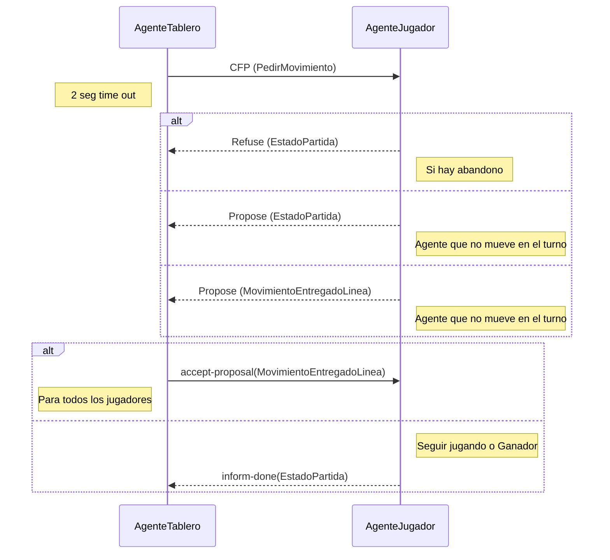
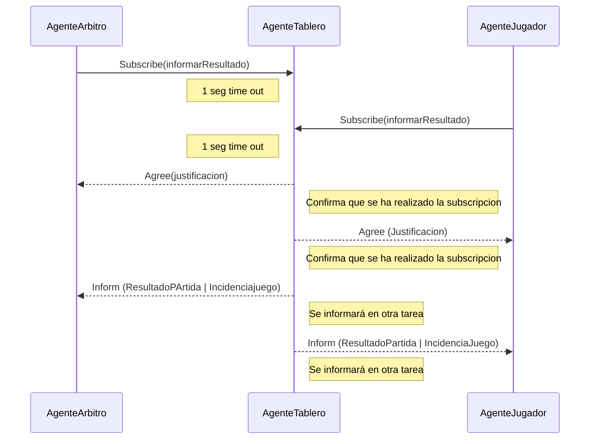

  

# Práctica 4 . Ontologías Juegos de mesa

  
## Objetivo
Esta práctica de la asignatura de Sistemas Multiagente tiene como objetivo una primera toma de contacto con el analisis de las ontologías y su aplicación práctica en juegos de tablero reales. 
El diseño de las ontologías estará pensado para resolver las necesidades de comunicación de los agentes implicados en las prácticas. Estos agentes estarán diseñados para responder a los eventos necesarios para:

- Localizar a los agentes especializados:
    
    - Agentes que se encargan de completar los juegos y presentar una representación del juego.
    - Agentes organizadores que distribuyen los juegos para que los agentes especializados en el juego puedan completarlo.
    - Agentes jugadores para uno o varios juegos. Los agentes que se diseñen para los diferentes juegos se suponen que juegan correctamente, es decir, no tienen la posibilidad para _hacer trampa_.
    
- Realizar las tareas necesarias para los diferentes juegos:

    - Recopilar a los agentes jugadores que estén dispuestos a jugar una partida o un torneo.
    - Completar los turnos necesarios para una partida individual entre dos agentes jugadores.
    - Comunicar el resultado de las diferentes partidas.
  
En nuestro caso, vamos a diseñar las ontologías para los siguientes juegos: 
1. [BackGammon](https://www.youtube.com/watch?v=peTdgXYeQKg)
2. [Parchís](https://www.youtube.com/watch?v=zyB784dKiBM)
3. [Escalera](https://www.youtube.com/watch?v=ncYhKhGsQwc)
4. [Gatos y raton](https://www.youtube.com/watch?v=Eo_UdPnwTno)

Como el diseño de las ontologías estará enfocado en resolver las necesidades de comunicación entre los agentes se incluirán los diagramas UML para los diferentes protocolos de comunicación entre **agentes-FIPA** que las resuelven.
  
## 1. Análisis de la ontología
---
Nuestra ontología debe responder apropiadamente a las siguientes preguntas:

1. ¿Cómo diferenciar a los diferentes agentes especializados?
2. ¿Cómo proponer a los diferentes jugadores que participen en un juego?
3. ¿Cómo debe completarse un juego ?
4. ¿Cómo obtener el resultado del juego propuesto?
5. ¿Cómo generar las partidas que componen un juego?
6. ¿Cómo completar un turno de una partida? ¿Cómo completar la partida?
7. ¿Cómo informar del resultado final de la partida?

Estas preguntas van a necesitar que se intercambie información entre los agentes de la plataforma. Para resolver las diferentes preguntas se presentan los diagramas UML para la secuencia de mensajes que deben intercambiarse entre los agentes implicados.

##### 1.1 ¿Cómo diferenciar a los diferentes agentes especializados?
Para resolver esta pregunta utilizaremos la utilidad del servicio de páginas amarillas que nos proporciona la plataforma de **agentes-FIPA**. De esta forma no será necesario tener elementos en la ontología para poder resolver el problema de comunicación pero sí será necesario un elemento en el vocabulario para que los agentes puedan subscribirse en el servicio de páginas amarillas de forma homogénea:

`TipoServicio` : Los agentes especializados tendrán asociado un tipo de servicio y utilizan este elemento del vocabulario. Los agentes especializados serán:

- `JUGADOR` : Representa el tipo de servicio para cualquier agente jugador de alguno de los tipos de juegos representados en la ontología.
- `TABLERO` : Representa el tipo de servicio que mantiene el estado del juego y responde a las consultas de los otros agentes sobre el estado del juego. 
- `ARBRITO` : Representa el tipo de servicio que proporcionan los agentes que se encargarán de la organización de las partidas que representan un juego. Supervisa el juego y aplica las reglas del juego. 

`TipoJuego` : Representa a los tipos de juegos representados en la ontología y que formará parte del nombre del servicio del agente y también forma parte del vocabulario.

- ``[BackGammon | Parchis | Escalera | Gatos y raton]`` 

Hay un agente especializado que será el encargado en localizar a todos los agentes especializados. Este agente es `AgenteMonitor` y que deberá conocer todos los elementos de la ontología y será desarrollado por el profesor de la asignatura.


Las tareas de los agentes serán diseñadas por cada uno de los alumnos. Los agentes tienen unos parámetros y unos objetivos que deben alcanzar antes de finalizar.

##### 1.2 ¿Cómo proponer a los diferentes jugadores que participen en un juego?

El `AgenteMonitor` propondrá un juego, de alguno de los tipos que conoce, a los `AgenteJugador` para ese tipo de juego. El juego debe identificarse de forma unívoca y los jugadores pueden tomar su decisión para participar en el juego atendiendo a su estado actual.



En el diagrama se presentan los elementos de la ontología que deberán formar parte del contenido del mensaje que se envía al agente. Los elementos de la ontología tendrán los siguientes atributos:

- `ProponerJuego` : Tiene la información necesaria para que los agentes puedan tomar su decisión
	- `Juego` : representa al juego en el que debe participar el jugador.
		- `idJuego` : identificará de forma unívoca el juego.
		- `TipoJuego` : ``[BackGammon | Parchis | Escalera | Gatos y raton]`` uno de los tipos de juego disponibles en la ontología.
	- `Modo` : ``[UNICO | ELIMINATORIA | TORNEO]`` desarrollo del juego. Esto determina en el número de partidas que deberá completar cada jugador en el juego.
	
	 - `InfoJuego` : es un concepto abstracto que permite representar los datos necesarios de un juego. De esta forma se extender la ontología con nuevos tipos de juegos.
		- `BackGammon` : los atributos necesarios para el juego del BackGammon.
			- `Tablero` : dimensiones del tablero para un juego de BackGammon, que seria el numero de casillas .
		- `Parchis` : los atributos necesarios para el juego Parchís.
			- `Tablero` : dimensiones del tablero para un juego de Parchís, que seria el número de casillas.
			- `numJugadores` : número de jugadores para el juego.
		- `Escalera` : los atributos necesarios para el juego Escalera.
			- `Tablero` : dimensiones del tablero para un juego Escalera.
			- `numJugadores` : número de jugadores para el juego.
			- `numEscaleras`: numero de escaleras para el juego
			- `numSerpientes`: numero de serpientes
		- `Gatos y raton` : los atributos necesarios para un juego Gatos y ratón 
			- `Tablero` : dimensiones del tablero para un juego Escalera.

- `Justificacion` : Es un elemento del vocabulario y contendrá las posibilidades que dispone el agente para indicar el rechazo para participar en el juego.
	-  `Juego` : representa el juego en el que no se desea participar.
	- `Motivo` : justificación para no participar en el juego. Los posibles motivos estarán recogidos en el vocabulario:

```
JUEGOS_ACTIVOS_SUPERADOS | PARTICIPACION_EN_JUEGOS_SUPERADA | 
TIPO_JUEGO_NO_IMPLEMENTADO | DEMASIADOS_JUEGOS_SIN_COMPLETAR | SUPERADO_LIMITE_PARTIDAS 
| SUBSCRIPCION_ACEPTADA | ERROR_SUBSCRIPCION | ERROR_CANCELACION | ONTOLOGIA_DESCONOCIDA
```

- `JuegoAceptado` : Permite al agente indicar que desea participar en el juego. Ya sea como jugador u organizador.
	- `Juego` : representa el juego en el que desea participar el agente. 
	- `AgenteJugador` : representa al agente especializado que desea participar en el juego. Es un concepto abstracto que permite representar a los agentes especializados y así poder extender la ontología para atender la posibilidad que se añadan más agentes especializados.

##### 1.3 ¿Cómo debe completarse un juego ?

Cuando el `AgenteMonitor` ha localizado jugadores que están dispuestos a participar en un juego hay que localizar a un `AgenteÁrbitro` que se encargue de generar las partidas necesarias para completar ese juego.


En el diagrama se presentan los elementos de la ontología que deberán formar parte del contenido del mensaje que se envía al agente. Los elementos de la ontología tendrán los siguientes atributos:

- `CompletarJuego` : Tiene la información necesaria para generar las partidas individuales que permitan completar el juego propuesto.
    - `Juego` : juego que se debe completar.
    - `Modo` : ``[UNICO | ELIMINATORIA | TORNEO]`` desarrollo del juego. Esto determina en el número de partidas que deberá completar cada jugador en el juego.
    - `InfoJuego` : es un concepto abstracto que permite representar los datos necesarios de un juego. De esta forma se extender la ontología con nuevos tipos de juegos.
    - `ListaJugadores` : es una colección de elementos `Jugador`, y al menos deben ser dos, que participarán en las partidas que definen el juego.

Los otros elementos de la ontología ya han sido descritos en el punto anterior.

##### 1.4 ¿Cómo obtener el resultado del juego propuesto ?
Para que el `AgenteMonitor` pueda recibir la información del resultado de los juegos que proponga a diferentes `AgenteArbitro` será necesario el siguiente intercambio de mensajes:



En el diagrama se presentan los elementos de la ontología que deberán formar parte del contenido del mensaje que se envía al agente. Los elementos de la ontología tendrán los siguientes atributos:

- `InformarResultado` : Representa la información del agente que quiere recibir la información del resultado del juego
	- `AgenteJugador` : representa al agente especializado que desea recibir la información. Es un concepto abstracto que permite representar a los agentes especializados y así poder extender la ontología para atender la posibilidad que se añadan más agentes especializados.

- `SubInform` : Elemento abstracto para representar las posibilidades de información que puede recibir el agente especializado. En este caso los valores pueden ser:
	-  ``[ClasificacionJuego | IncidenciaJuego ]`` contempla las posibilidades de finalización de un juego.

- `ClasificacionJuego` : Si el juego ha finalizado correctamente se envía la información relativa a la clasificación del juego con los jugadores implicados.
	- `Juego` : representa el juego que ha finalizado.
	- `ListaJugadores` : colección de elementos `Jugador` que han participado en el juego ordenados desde el campeón en adelante.
	- `ListaPuntuacion` : colección con los puntos obtenidos por cada uno de los jugadores de la lista anterior. 

- `IncidenciaJuego` : si la partida no finaliza de forma normal este elemento indicará el motivo
	- ``[CANCELADO, JUGADORES_INSUFICIENTES]`` posibles valores recogidos en el vocabulario para una finalización incompleta del juego.

##### 1.5 ¿Cómo generar las partidas que componen un juego ?

El `AgenteArbitro` se encarga de ir generando las rondas necesarias para completar el juego. El número de rondas dependerá del atributo `Modo` del elemento `CompletarJuego`. En cada ronda se generan un número de partidas que deben ser completadas por el `AgenteTablero`.





##### 1.6 ¿Como completar un turno de una partida ?¿Como completar la partida?

El `AgenteTablero` es el encargado de organizar los turnos que componen una partida. De esta forma lo importante es identificar los elementos de información necesarios para completar un turno de juego. Para completar la partida hay que ir generando los turnos necesarios hasta obtener un ganador o declarar un empate.

Para completar un turno de juego se envía el mismo mensaje a los jugadores que tiene la partida. La información necesaria depende del tipo de juego:

Turno para los juegos:

**Parchís, Escalera y Backgammon**



En el diagrama se presentan los elementos de la ontología que deberán formar parte del contenido del mensaje que se envía al agente. Los elementos de la ontología tendrán los siguientes atributos:

- `TiradaDado`: estos juegos necesitan tirar uno o varios dados para calcular el movimiento
	- `NumeroMovimientos`: cuantas casillas se podrá mover la ficha

- `PedirMovimiento` : Información necesaria para completar el turno de juego.
    - `Partida` : partida a la que corresponde el turno.
    - `Jugador` : jugador que tiene que realizar el movimiento, **jugador activo**.

- `EstadoPartida` : Información sobre posibles contingencias que pueden ocurrir durante la partida.
    - `Partida` : partida a la que corresponde el turno.
    - `Estado` : posibles estados en los que se puede encontrar la partida. Sus valores están definidos en el vocabulario.
        - ``[GANADOR | ABANDONO | SEGUIR_JUGANDO | FIN_PARTIDA | JUGADOR_NO_ACTIVO]``

- `MovimientoEntregado` : Información del movimiento que realiza el jugador activo del turno. 
    - `Partida` : partida a la que corresponde el turno.
    - `Movimiento` : un movimiento válido, suponemos que los jugadores juegan correctamente.
        - `FichaJuego` : elemento abstracto que permite representar las posibles fichas de un juego.
        - `Posicion` : localización de la ficha en el tablero.
            - (`Fila` , `Columna`)

- `FichaJuego`
	- `Ficha Parchis y Escalera` : ficha para los juegos
		- `Jugador` : jugador asociado a la ficha
		- `Color` : ``[ ROJO | AZUL | VERDE | AMARILLO]`` una de las posibilidades definidas en el vocabulario de la ontología.
	

La única diferencia entre estos dos juegos es que en el parchís, el jugador puede elegir entre 4 fichas que están asociadas a él para poder hacer el movimiento, mientras que en la Escalera, el jugador solo podrá mover una única ficha.

- `FichaJuego`
	- `Ficha Backgammon` : ficha para los juegos
		- `Jugador` : jugador asociado a la ficha
		- `Color` : ``[ BLANCO | NEGRO]`` una de las posibilidades definidas en el vocabulario de la ontología.

**Gatos y ratón**


En el diagrama se presentan los elementos de la ontología que deberán formar parte del contenido del mensaje que se envía al agente. Los elementos de la ontología tendrán los siguientes atributos:

- `PedirMovimiento` : Información necesaria para completar el turno de juego.
    - `Partida` : partida a la que corresponde el turno.
    - `Jugador` : jugador que tiene que realizar el movimiento, **jugador activo**.

- `EstadoPartida` : Información sobre posibles contingencias que pueden ocurrir durante la partida.
    - `Partida` : partida a la que corresponde el turno.
    - `Estado` : posibles estados en los que se puede encontrar la partida. Sus valores están definidos en el vocabulario.
        - ``[GANADOR | ABANDONO | SEGUIR_JUGANDO | FIN_PARTIDA | JUGADOR_NO_ACTIVO]``

- `MovimientoEntregado` : Información del movimiento que realiza el jugador activo del turno. 
    - `Partida` : partida a la que corresponde el turno.
    - `Movimiento` : un movimiento válido, suponemos que los jugadores juegan correctamente.
        - `FichaJuego` : elemento abstracto que permite representar las posibles fichas de un juego.
        - `Posicion` : localización de la ficha en el tablero.
            - (`Fila` , `Columna`)

- `FichaJuego`
	- `Ficha Parchis y Escalera` : ficha para los juegos
		- `Jugador` : jugador asociado a la ficha
		- `Color` : ``[ BLANCO | NEGRO]`` una de las posibilidades definidas en el vocabulario de la ontología.
	

##### 1.7 ¿Como informar del resultado de la partida?
Un `AgenteArbitro` o  `AgenteJugador` que participe en partidas dirigidas por un `AgenteTablero` necesita conocer el resultado de las partidas que el `AgenteTablero` complete. La información que remite el `AgenteTablero` debe identificar el agente que la solicita para reciba solo las partidas en las que está implicado.



En el diagrama se presentan los elementos de la ontología que deberán formar parte del contenido del mensaje que se envía al agente. En la **sección 1.4** ya se han presentado los elementos de la ontología que son necesarios. En este punto solo hay que especificar los siguientes elementos:

- `SubInform` : Elemento abstracto para representar las posibilidades de información que puede recibir el agente especializado. En este caso los valores pueden ser:
    
    - ``[ ResultadoPartida | IncidenciaJuego]``contempla las posibilidades de finalización de la partida.

- `ResultadoPartida` : Representa el resultado de la partida.
    - `Partida` : datos de la partida que se ha completado.
    - `Jugador` : representa al ganador de la partida. Si no hay ganador se incluirá un `Jugador`vacío, esto es, `new Jugador("",new AID())`.

El **Agente Árbitro** supervisa el juego y aplica las reglas del juego. El Agente Árbitro valida los movimientos propuestos por el Agente Jugador, determina cuándo es el turno de cada jugador, y determina cuándo el juego ha terminado y quién es el ganador.


### 2. Diseño de la ontología
---
En la sección anterior se han presentado todos los elementos y relaciones que se presentan en la ontología necesaria para completar los juegos propuesto. Para el diseño de la ontología se tendrá presente su implementación con las capacidades que nos proporciona la biblioteca de agentes [Jade](https://jade.tilab.com/doc/api/jade/content/package-frame.html). De esta forma se presentarán unos diagramas de clase donde se muestran las relaciones entre ellas. Se presentan dos diagramas atendiendo a los elementos:

- `Concept` : Elementos que representan la información necesaria para representar los diferentes tipos de juegos de la ontología.
- `AgentAction` : Elementos que representas los eventos a los que responden los agentes para completar los juegos de la ontología.

2.1 Diagrama para elementos Concept


2.2 Diagrama para elementos AgenteAction


  Nuestra ontología de dominio común incluye los siguientes conceptos:
#### Clases

-   **Jugador**: Representa a un jugador en el juego. Cada jugador es un agente en nuestro sistema.
    
-   **Movimiento**: Representa un movimiento que un jugador puede hacer en el juego. Un movimiento implica mover una ficha de una posición a otra en el tablero.
    
-   **Tablero**: Representa el tablero del juego. El tablero tiene una serie de posiciones donde las fichas pueden ser colocadas.
    
-   **Ficha**: Representa una ficha que un jugador puede mover en el tablero.
    
-   **Posición**: Representa una posición en el tablero. Cada posición puede estar ocupada por una ficha o estar vacía.
#### Relaciones de la ontología
-   **PerteneceA**: Esta relación conecta una ficha con el jugador al que pertenece. Cada ficha en el juego es propiedad de un jugador específico, y esta relación permite a los agentes saber a quién pertenece cada ficha.
    
-   **UbicadaEn**: Esta relación conecta una ficha con la posición del tablero en la que se encuentra. Cada ficha en el juego se encuentra en una posición específica en el tablero, y esta relación permite a los agentes saber dónde está cada ficha.
    
-   **SiguientePosición**: Esta relación conecta una posición del tablero con la siguiente posición en el camino del juego. Esta relación es crucial para entender cómo se mueven las fichas a lo largo del tablero.
    
-   **TieneTurno**: Esta relación conecta un jugador con el estado del juego para indicar quién tiene el turno actual. Esta relación permite a los agentes saber quién debe hacer el próximo movimiento.

#### Restricciones de la ontología
-  **Restricción de propiedad única**: Cada ficha pertenece a un único jugador y está en una única posición en el tablero en un momento dado. Esto significa que la relación "PerteneceA" y "UbicadaEn" solo puede tener un valor para cada ficha en un momento dado.
    
-  **Restricción de propiedad obligatoria**: Cada ficha debe pertenecer a un jugador y debe estar en alguna posición del tablero. Esto significa que cada ficha debe tener un valor para las relaciones "PerteneceA" y "UbicadaEn".
    
- **Restricción de cardinalidad**: Cada jugador puede tener un número limitado de fichas. Por ejemplo, en el Parchís, cada jugador tiene exactamente 4 fichas.
    
-  **Restricciones de juego específicas**: 
	- Parchís
		-  **Movimiento de salida**: Una ficha solo puede salir de su casa si el jugador saca un 5 en el dado.
    
		-  **Movimiento de barrera**: Dos fichas del mismo jugador en la misma casilla forman una barrera que no puede ser pasada por fichas de otros jugadores.
    
		- **Movimiento de captura**: Si una ficha cae en una casilla ocupada por una ficha de otro jugador, la ficha del otro jugador es capturada y vuelve a su casa.
    
		-  **Movimiento de entrada a meta**: Una ficha solo puede entrar a la meta con una tirada de dado exacta.
	- Juego escalera
		-   **Movimiento de escalera**: Si una ficha cae en una casilla con el inicio de una escalera, debe moverse a la casilla en el otro extremo de la escalera.
    
		- **Movimiento de serpiente**: Si una ficha cae en una casilla con la cola de una serpiente, debe moverse a la casilla en el otro extremo de la serpiente.
    
		- **Movimiento de ganar**: Un jugador gana el juego cuando su ficha llega a la última casilla del tablero.
#### Instancias de la ontología
-  **Instancias de Jugador**: Cada jugador individual en un juego sería una instancia de la clase Jugador. 
	- ##### Parchís
		- En el Parchís, normalmente juegan cuatro jugadores, por lo que tendrías cuatro instancias de la clase Jugador.
	- ##### Juego escalera
		-  	En el juego de la Escalera, normalmente juegan dos jugadores, por lo que tendrías dos instancias de la clase Jugador.
    
-  **Instancias de Ficha**: Cada ficha individual en un juego sería una instancia de la clase Ficha. 
	- ##### Parchís
		- Cada jugador en el Parchís tiene cuatro fichas, por lo que tendrías un total de 16 instancias de la clase Ficha.
	- ##### Juego escalera
		-  	Cada jugador en el juego de la Escalera tiene una ficha, por lo que tendrías un total de dos instancias de la clase Ficha.
-  **Instancias de Posición**: Cada casilla individual en el tablero sería una instancia de la clase Posición. 
	- ##### Parchís
		- El tablero de Parchís tiene 68 posiciones en total (contando las casillas de seguridad y las casillas de meta), por lo que tendrías 68 instancias de la clase Posición.
	- ##### Juego escalera
		-  	El tablero del juego de la Escalera tiene 100 casillas, por lo que tendrías 100 instancias de la clase Posición
    
-  **Instancias de Juego**: Cada juego individual que se juega sería una instancia de la clase Juego.
	- ##### Parchís
		- Cada partida de Parchís que juegues sería una instancia de la clase Juego.
	- ##### Juego escalera
		-  	Cada partida del juego de la Escalera que juegues sería una instancia de la clase Juego.
#### Axiomas
-  **Axioma de propiedad**: Cada ficha en el juego es propiedad de un jugador específico. Esto significa que la relación "PerteneceA" siempre debe tener un valor para cada ficha.
    
-  **Axioma de ubicación**: Cada ficha en el juego se encuentra en una posición específica en el tablero. Esto significa que la relación "UbicadaEn" siempre debe tener un valor para cada ficha.
    
-  **Axioma de turno**: En cualquier momento del juego, solo un jugador tiene el turno. Esto significa que la relación "TieneTurno" solo puede tener un valor en cualquier momento dado.
    
-  **Axioma de victoria**: Un jugador gana el juego cuando todas sus fichas han llegado a la meta (en el caso del Parchís) o cuando su ficha ha llegado a la última casilla del tablero (en el caso del juego de la Escalera).

#### Funciones de la ontología
-  **Función de movimiento**: Esta función tomaría una ficha y una posición como entrada y movería la ficha a la posición dada. Esta función sería útil para actualizar el estado del juego después de que un jugador haga un movimiento.
```
Función MoverFicha(ficha, posición):
    Si la posición es válida para la ficha según las reglas del juego:
        Actualizar la relación "UbicadaEn" de la ficha para que apunte a la nueva posición
    Si no:
        Devolver un error indicando que el movimiento no es válido
Fin de la función

```
    
-  **Función de verificación de movimiento**: Esta función tomaría una ficha y una posición como entrada y verificaría si el movimiento propuesto es válido de acuerdo con las reglas del juego. Esta función sería útil para el Agente Árbitro al validar los movimientos propuestos.
 ```
Función VerificarMovimiento(ficha, posición):
    Si la posición es una casilla válida en el tablero:
        Si la posición está vacía o el movimiento a esa posición es permitido por las reglas del juego:
            Devolver Verdadero
        Fin Si
    Fin Si
    Devolver Falso
Fin de la Función
```
    
-  **Función de conteo de fichas**: Esta función tomaría un jugador como entrada y devolvería el número de fichas que el jugador tiene en el tablero. Esta función sería útil para determinar el progreso de un jugador en el juego.
```
Función ContarFichas(jugador):
    Contador = 0
    Para cada ficha en el conjunto de todas las fichas:
        Si la ficha pertenece al jugador:
            Incrementar el Contador en 1
        Fin Si
    Fin Para
    Devolver Contador
Fin de la Función

```
    
-  **Función de determinación de ganador**: Esta función revisaría el estado del juego y determinaría si algún jugador ha ganado el juego. Esta función sería útil para el Agente Árbitro al determinar el fin del juego.
```
Función DeterminarGanador():
    Para cada jugador en el conjunto de todos los jugadores:
        Si todas las fichas del jugador han llegado a la meta (o cumplen la condición de victoria del juego):
            Devolver jugador
        Fin Si
    Fin Para
    Devolver Ninguno
Fin de la Función

```
