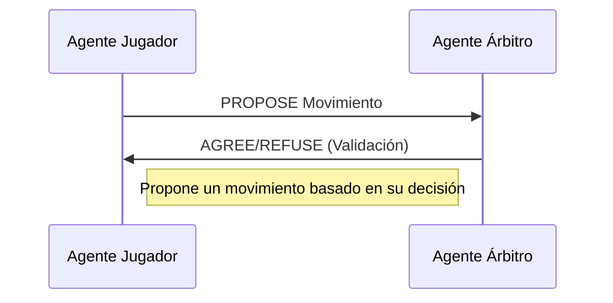
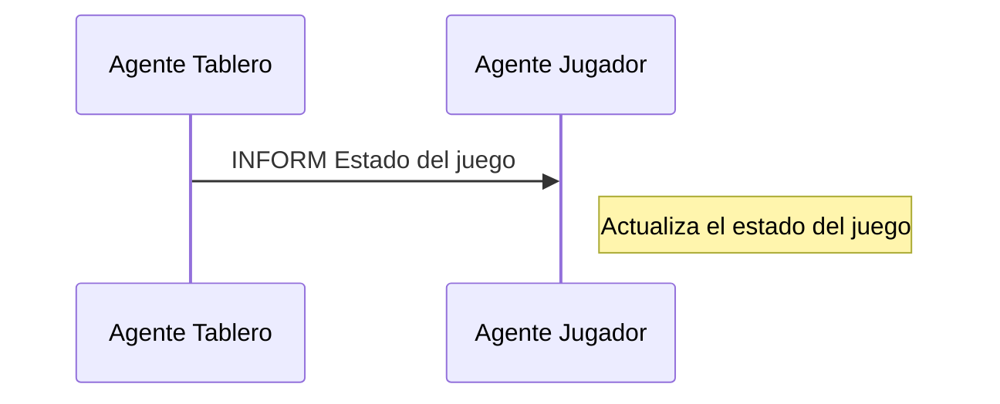
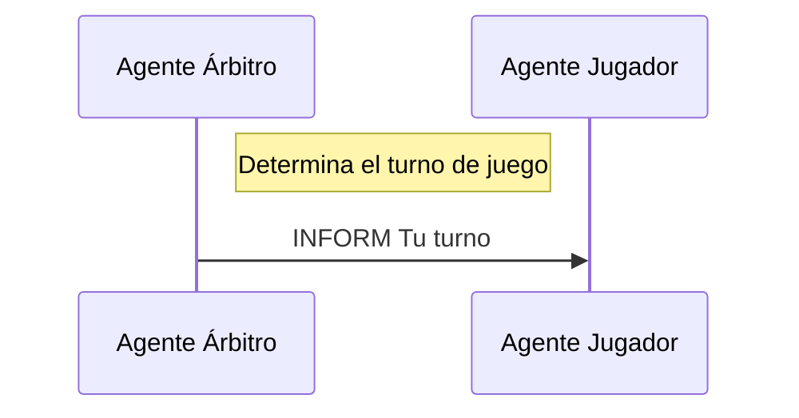
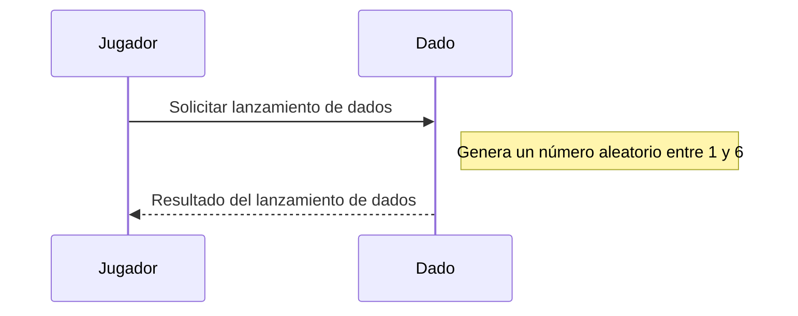
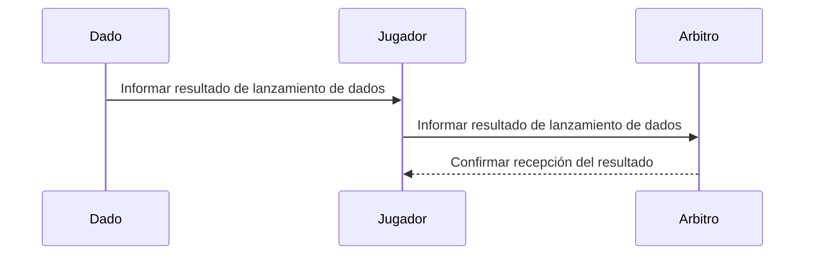

  

# Práctica 4 . Ontologías Juegos de mesa

  
## Objetivo
Esta práctica de la asignatura de Sistemas Multiagente tiene como objetivo una primera toma de contacto con el analisis de las ontologías y su aplicación práctica en juegos de tablero reales. 
El diseño de las ontologías estará pensado para resolver las necesidades de comunicación de los agentes implicados en las prácticas. Estos agentes estarán diseñados para responder a los eventos necesarios para:

- Localizar a los agentes especializados:
    
    - Agentes que se encargan de completar los juegos y presentar una representación del juego.
    - Agentes organizadores que distribuyen los juegos para que los agentes especializados en el juego puedan completarlo.
    - Agentes jugadores para uno o varios juegos. Los agentes que se diseñen para los diferentes juegos se suponen que juegan correctamente, es decir, no tienen la posibilidad para _hacer trampa_.
    
- Realizar las tareas necesarias para los diferentes juegos:

    - Recopilar a los agentes jugadores que estén dispuestos a jugar una partida o un torneo.
    - Completar los turnos necesarios para una partida individual entre dos agentes jugadores.
    - Comunicar el resultado de las diferentes partidas.
  
En nuestro caso, vamos a diseñar las ontologías para los siguientes juegos: 
1. BackGammon
2. Parchis
3. Escalera
4. Gatos y raton

Como el diseño de las ontologías estará enfocado en resolver las necesidades de comunicación entre los agentes se incluirán los diagramas UML para los diferentes protocolos de comunicación entre **agentes-FIPA** que las resuelven.
  
## 1. Análisis de la ontología
---
Nuestra ontología debe responder apropiadamente a las siguientes preguntas:

1. ¿Cómo diferenciar a los diferentes agentes especializados?
2. ¿Cómo proponer a los diferentes jugadores que participen en un juego?
3. ¿Cómo debe completarse un juego ?
4. ¿Cómo obtener el resultado del juego propuesto?
5. ¿Cómo generar las partidas que componen un juego?
6. ¿Cómo completar un turno de una partida? ¿Cómo completar la partida?
7. ¿Cómo informar del resultado final de la partida?

Estas preguntas van a necesitar que se intercambie información entre los agentes de la plataforma. Para resolver las diferentes preguntas se presentan los diagramas UML para la secuencia de mensajes que deben intercambiarse entre los agentes implicados.

##### 1.1 ¿Cómo diferenciar a los diferentes agentes especializados?
Para resolver esta pregunta utilizaremos la utilidad del servicio de páginas amarillas que nos proporciona la plataforma de **agentes-FIPA**. De esta forma no será necesario tener elementos en la ontología para poder resolver el problema de comunicación pero sí será necesario un elemento en el vocabulario para que los agentes puedan subscribirse en el servicio de páginas amarillas de forma homogénea:

`TipoServicio` : Los agentes especializados tendrán asociado un tipo de servicio y utilizan este elemento del vocabulario. Los agentes especializados serán:

- `JUGADOR` : Representa el tipo de servicio para cualquier agente jugador de alguno de los tipos de juegos representados en la ontología.
- `TABLERO` : Representa el tipo de servicio que mantiene el estado del juego y responde a las consultas de los otros agentes sobre el estado del juego. 
- `ARBRITO` : Representa el tipo de servicio que proporcionan los agentes que se encargarán de la organización de las partidas que representan un juego. Supervisa el juego y aplica las reglas del juego. 

`TipoJuego` : Representa a los tipos de juegos representados en la ontología y que formará parte del nombre del servicio del agente y también forma parte del vocabulario.

- ``[`BackGammon` | `Parchis` | `Escalera` | `Gatos y raton`]`` 

Hay un agente especializado que será el encargado en localizar a todos los agentes especializados. Este agente es `AgenteMonitor` y que deberá conocer todos los elementos de la ontología y será desarrollado por el profesor de la asignatura.


Las tareas de los agentes serán diseñadas por cada uno de los alumnos. Los agentes tienen unos parámetros y unos objetivos que deben alcanzar antes de finalizar.

##### 2. ¿Cómo proponer a los diferentes jugadores que participen en un juego?

Todos los agentes:

  

- Deben ser robustos y dar soluciones a las posibles incidencias en la ejecución.

#### AgenteJugador
Este agente representa a un jugador en el juego. Su tarea principal es decidir qué movimientos hacer en función del estado del juego. Este agente debería ser lo suficientemente flexible como para poder jugar a cualquier juego de tablero, no solo al Juego de la Escalera o al Parchís.

##### Tareas
- **Interpretar el estado del juego**: Cuando el Agente Tablero envía una actualización sobre el estado del juego, el Agente Jugador debe ser capaz de interpretar esa información y entender qué está pasando en el juego. Esto incluiría entender la posición de su propia ficha, la posición de las fichas de los otros jugadores, la presencia de elementos especiales como escaleras o serpientes, etc.
 ```mermaid

sequenceDiagram
    participant AgenteTablero as Agente Tablero
    participant AgenteJugador as Agente Jugador
    AgenteTablero->>AgenteJugador: INFORM (Estado del juego)
    Note right of AgenteJugador: Interpreta el estado del juego
```


-  **Decidir movimiento específico del juego**: En esta tarea se decide  un movimiento de acuerdo con las reglas y estrategias específicas del juego que se está jugando
 ```mermaid
sequenceDiagram
    participant AgenteJugador as Agente Jugador
    participant AgenteTablero as Agente Tablero
    participant AgenteArbitro as Agente Árbitro
    AgenteJugador->>AgenteTablero: REQUEST Estado del juego
    AgenteTablero-->>AgenteJugador: INFORM Estado del juego
    Note right of AgenteJugador: Decide un movimiento basado en las reglas y estrategias específicas del juego
    AgenteJugador->>AgenteArbitro: PROPOSE Movimiento
    Note right of AgenteArbitro: Verifica si el movimiento es válido según las reglas específicas del juego
    alt Movimiento válido
        AgenteArbitro-->>AgenteJugador: ACCEPT-PROPOSAL Movimiento
    else Movimiento inválido
        AgenteArbitro-->>AgenteJugador: REJECT-PROPOSAL Movimiento
    end

```
    
- **Proponer el movimiento al Agente Arbitro**: Una vez que el Agente Jugador ha decidido qué movimiento hacer, debe proponer ese movimiento al Agente Arbitro utilizando el protocolo FIPA PROPOSE. El Agente Jugador debe ser capaz de comunicar su movimiento propuesto de una manera que el Agente Arbitro pueda entender.

    
- **Responder a la validación del Agente Arbitro**: Si el Agente Arbitro valida el movimiento propuesto el Agente Jugador puede proceder con su turno. Si el Agente Arbitro rechaza el movimiento propuesto el Agente Jugador debe ser capaz de proponer un nuevo movimiento.

    
- **Actualizar el estado del juego**: Una vez que el Agente Jugador ha completado su turno, debe ser capaz de actualizar su comprensión del estado del juego en función del movimiento que acaba de hacer.

    
-  **Responder al fin del juego**: Cuando el Agente Arbitro anuncia el fin del juego (usando el protocolo FIPA INFORM), el Agente Jugador debe ser capaz de interpretar esa información y responder adecuadamente. Esto podría incluir celebrar si ha ganado, o reconocer la derrota si ha perdido.
 ```mermaid
sequenceDiagram
    participant AgenteArbitro as Agente Árbitro
    participant AgenteTablero as Agente Tablero
    participant AgenteJugador as Agente Jugador
    AgenteArbitro->>AgenteTablero: INFORM Fin del juego
    AgenteTablero->>AgenteJugador: INFORM Estado final del juego
    AgenteJugador->>AgenteArbitro: INFORM Reconocimiento del fin del juego
    Note right of AgenteJugador: Responde al fin del juego

```


**AgenteTablero**
Este agente representa al tablero del juego. Su tarea principal es mantener el estado del juego, que podría incluir la posición de las fichas, la presencia de elementos especiales como escaleras o serpientes (en el caso del Juego de la Escalera), etc. Este agente también debería ser lo suficientemente flexible como para poder manejar cualquier tipo de tablero de juego.

##### Tareas
- **Inicializar el estado del juego**: Al inicio del juego, el Agente Tablero debe establecer el estado inicial del juego. Esto podría incluir la colocación inicial de las fichas, la configuración de las escaleras y serpientes (en el caso del Juego de la Escalera), etc.
 ```mermaid
sequenceDiagram
    participant AgenteTablero as Agente Tablero
    participant AgenteJugador as Agente Jugador
    participant AgenteArbitro as Agente Árbitro
    AgenteTablero->>AgenteTablero: Inicializar estado del juego
    Note right of AgenteTablero: Establece el estado inicial del tablero
    AgenteTablero->>AgenteJugador: INFORM Estado inicial del juego
    AgenteTablero->>AgenteArbitro: INFORM Estado inicial del juego

```
    
-  **Mantener el estado del juego**: Durante el juego, el Agente Tablero debe mantener un registro actualizado del estado del juego. Esto incluiría la posición de cada ficha, la presencia de elementos especiales como escaleras o serpientes, etc.
 ```mermaid
sequenceDiagram
    participant AgenteTablero as Agente Tablero
    Note over AgenteTablero: Mantiene el estado del juego


```
    
-  **Actualizar el estado del juego**: Cuando un Agente Jugador realiza un movimiento, el Agente Tablero debe actualizar el estado del juego en consecuencia. Esto podría implicar mover una ficha de una casilla a otra, aplicar los efectos de una escalera o serpiente, etc.
 ```mermaid
sequenceDiagram
    participant AgenteJugador as Agente Jugador
    participant AgenteTablero as Agente Tablero
    participant AgenteArbitro as Agente Árbitro
    AgenteJugador->>AgenteTablero: INFORM Movimiento
    Note right of AgenteTablero: Actualiza el estado del tablero
    AgenteTablero->>AgenteJugador: INFORM Estado actualizado del juego
    AgenteTablero->>AgenteArbitro: INFORM Estado actualizado del juego


```
    
-  **Informar el estado del juego**: El Agente Tablero debe ser capaz de informar el estado actual del juego a los demás agentes. Esto podría hacerse utilizando el protocolo FIPA INFORM para enviar una representación del estado del juego a los Agentes Jugadores y al Agente Arbitro.
 ```mermaid
sequenceDiagram
    participant AgenteTablero as Agente Tablero
    participant AgenteJugador as Agente Jugador
    participant AgenteArbitro as Agente Árbitro
    AgenteTablero->>AgenteJugador: INFORM Estado del juego
    AgenteTablero->>AgenteArbitro: INFORM Estado del juego
    Note right of AgenteTablero: Informa el estado actual del juego


```
    
- **Responder a consultas sobre el estado del juego**: El Agente Tablero debe ser capaz de responder a las consultas de los demás agentes sobre el estado del juego. Por ejemplo, un Agente Jugador podría usar el protocolo FIPA QUERY para preguntar sobre la posición de una ficha específica, y el Agente Tablero debería ser capaz de responder con la información correcta.
  
 ```mermaid
sequenceDiagram
    participant AgenteJugador as Agente Jugador
    participant AgenteTablero as Agente Tablero
    AgenteJugador->>AgenteTablero: REQUEST Estado del juego
    Note right of AgenteTablero: Recibe la solicitud y busca la información
    AgenteTablero->>AgenteJugador: INFORM Estado del juego
    Note right of AgenteTablero: Responde con la información solicitada


```
  
 **AgenteArbitro**
Este agente supervisa el juego y garantiza que se sigan las reglas. Su tarea principal es validar los movimientos propuestos por los Agentes Jugadores y determinar cuándo ha terminado el juego. Este agente debería ser capaz de entender y aplicar las reglas de cualquier juego de tablero (tal y como se indica que se tenga en consideración en la documentación)
##### Tareas
-  **Iniciar el juego**: Al inicio del juego, el Agente Árbitro debe notificar a los demás agentes que el juego ha comenzado. Esto podría hacerse utilizando el protocolo FIPA INFORM.
 ```mermaid
sequenceDiagram
    participant AgenteArbitro as Agente Árbitro
    participant AgenteJugador as Agente Jugador
    participant AgenteTablero as Agente Tablero
    AgenteArbitro->>AgenteJugador: INFORM Inicio del juego
    AgenteArbitro->>AgenteTablero: INFORM Inicio del juego
    Note right of AgenteArbitro: Inicia el juego


```
    
- **Validar los movimientos propuestos**: Cuando un Agente Jugador propone un movimiento (usando el protocolo FIPA PROPOSE), el Agente Árbitro debe validar ese movimiento. Esto implicaría comprobar que el movimiento es legal según las reglas del juego. Si el movimiento es válido, el Agente Árbitro usaría el protocolo FIPA AGREE para aceptar el movimiento. Si el movimiento no es válido, el Agente Árbitro usaría el protocolo FIPA REFUSE para rechazar el movimiento.
 ```mermaid
sequenceDiagram
    participant AgenteJugador as Agente Jugador
    participant AgenteArbitro as Agente Árbitro
    AgenteJugador->>AgenteArbitro: PROPOSE Movimiento
    Note right of AgenteArbitro: Valida el movimiento propuesto
    alt Movimiento válido
        AgenteArbitro->>AgenteJugador: AGREE Validación
    else Movimiento inválido
        AgenteArbitro->>AgenteJugador: REFUSE Validación
    end


```
    
- **Determinar el turno de juego**: El Agente Árbitro debe determinar qué Agente Jugador tiene el turno en cada momento. Esto podría hacerse siguiendo un orden preestablecido (por ejemplo, en el orden en que los Agentes Jugadores se unieron al juego), o podría basarse en las reglas específicas del juego.

    
-  **Determinar el fin del juego**: El Agente Árbitro debe determinar cuándo ha terminado el juego. Esto podría basarse en una variedad de condiciones, dependiendo de las reglas del juego. Por ejemplo, en el Juego de la Escalera, el juego terminaría cuando un jugador llega a la última casilla del tablero.
 ```mermaid
sequenceDiagram
    participant AgenteArbitro as Agente Árbitro
    participant AgenteJugador as Agente Jugador
    participant AgenteTablero as Agente Tablero
    Note right of AgenteArbitro: Determina el fin del juego
    alt Juego terminado
        AgenteArbitro->>AgenteJugador: INFORM Fin del juego
        AgenteArbitro->>AgenteTablero: INFORM Fin del juego
    else Juego continúa
        Note right of AgenteArbitro: El juego continúa
    end

```
    
-  **Anunciar el ganador**: Cuando el juego ha terminado, el Agente Árbitro debe anunciar el ganador. Esto podría hacerse utilizando el protocolo FIPA INFORM para enviar un mensaje a todos los agentes indicando quién ha ganado el juego.
 ```mermaid
sequenceDiagram
    participant AgenteArbitro as Agente Árbitro
    participant AgenteJugador as Agente Jugador
    participant AgenteTablero as Agente Tablero
    Note right of AgenteArbitro: Determina el ganador
    AgenteArbitro->>AgenteJugador: INFORM Ganador
    AgenteArbitro->>AgenteTablero: INFORM Ganador


```

-  **Validar movimiento específico del juego**: En esta tarea, el Agente Árbitro recibe una propuesta de movimiento del Agente Jugador. Este movimiento es entonces evaluado en el contexto de las reglas del juego específico. Por ejemplo, en el juego de los gatos y el ratón, esta tarea verificaría si los gatos sólo se están moviendo hacia adelante y si el ratón se está moviendo en cualquier dirección.
 ```mermaid
sequenceDiagram
    participant AgenteJugador as Agente Jugador
    participant AgenteArbitro as Agente Árbitro
    AgenteJugador->>AgenteArbitro: PROPOSE Movimiento
    Note right of AgenteArbitro: Verifica si el movimiento es válido según las reglas específicas del juego
    alt Movimiento válido
        AgenteArbitro-->>AgenteJugador: ACCEPT-PROPOSAL Movimiento
    else Movimiento inválido
        AgenteArbitro-->>AgenteJugador: REJECT-PROPOSAL Movimiento
    end


```


**AgenteDado**
El Agente Dado es responsable de simular el lanzamiento de dados en juegos donde los movimientos se determinan en parte por el azar, como en el backgammon, parchís Co.... Este agente tiene las siguientes tareas:
##### Tareas
-  **Lanzar los dados**: Esta tarea implica generar un número aleatorio que simula el resultado de lanzar un dado. El número generado debe estar dentro del rango válido para un dado, que normalmente es de 1 a 6.

    
-  **Informar el resultado**: Después de lanzar los dados, el Agente Dado debe informar el resultado a los otros agentes que necesiten esta información. Esto podría implicar enviar un mensaje INFORM a los Agentes Jugador y Árbitro con el resultado del lanzamiento.


  ## Diseño
  En esta sección, se describirá el diseño de nuestro sistema en detalle. Esto incluirá la arquitectura del sistema, el diseño de la ontología, el diseño de los agentes y sus tareas, los protocolos de comunicación que utilizarán los agentes, las estructuras de datos que utilizaremos para representar y gestionar el estado del juego, y el diseño de la interfaz de usuario.

El objetivo en esta etapa es tomar decisiones de diseño que permitan a nuestro sistema cumplir con los requisitos identificados durante la etapa de análisis de la manera más eficiente y efectiva posible. Esto incluye garantizar que nuestro sistema sea capaz de manejar una variedad de juegos de mesa, que los agentes puedan comunicarse y cooperar eficazmente para jugar los juegos, y que el estado del juego se represente y gestione de manera eficiente.

A continuación, comenzaremos con la arquitectura del sistema, que describe cómo se organizarán y dividirán las tareas entre los diferentes componentes del sistema.
### Arquitectura del sistema
Nuestro sistema de juegos de mesa basado en agentes se compone de **cuatro** tipos de agentes: el **Agente Jugador, el Agente Tablero, el Agente Árbitro y el Agente Dado**. Cada uno de estos agentes tiene roles y responsabilidades específicas en el sistema, como se describió en la etapa de análisis.

Los agentes interactúan entre sí a través de un entorno de comunicación basado en mensajes. Utilizamos **protocolos de comunicación FIPA** para estructurar estas interacciones, lo que permite a los agentes cooperar y coordinarse eficazmente para jugar los juegos.

El **Agente Jugador** es el responsable de decidir los movimientos en el juego. Para hacer esto, el Agente Jugador puede necesitar consultar el estado actual del juego, que es mantenido por el Agente Tablero.

El **Agente Tablero** mantiene el estado del juego y responde a las consultas de los otros agentes sobre el estado del juego. Cuando el Agente Jugador decide un movimiento, el Agente Tablero actualiza el estado del juego en consecuencia.

El **Agente Árbitro** supervisa el juego y aplica las reglas del juego. El Agente Árbitro valida los movimientos propuestos por el Agente Jugador, determina cuándo es el turno de cada jugador, y determina cuándo el juego ha terminado y quién es el ganador.

### Diseño de la ontología
  Nuestra ontología de dominio común incluye los siguientes conceptos:
#### Clases

-   **Jugador**: Representa a un jugador en el juego. Cada jugador es un agente en nuestro sistema.
    
-   **Movimiento**: Representa un movimiento que un jugador puede hacer en el juego. Un movimiento implica mover una ficha de una posición a otra en el tablero.
    
-   **Tablero**: Representa el tablero del juego. El tablero tiene una serie de posiciones donde las fichas pueden ser colocadas.
    
-   **Ficha**: Representa una ficha que un jugador puede mover en el tablero.
    
-   **Posición**: Representa una posición en el tablero. Cada posición puede estar ocupada por una ficha o estar vacía.
#### Relaciones de la ontología
-   **PerteneceA**: Esta relación conecta una ficha con el jugador al que pertenece. Cada ficha en el juego es propiedad de un jugador específico, y esta relación permite a los agentes saber a quién pertenece cada ficha.
    
-   **UbicadaEn**: Esta relación conecta una ficha con la posición del tablero en la que se encuentra. Cada ficha en el juego se encuentra en una posición específica en el tablero, y esta relación permite a los agentes saber dónde está cada ficha.
    
-   **SiguientePosición**: Esta relación conecta una posición del tablero con la siguiente posición en el camino del juego. Esta relación es crucial para entender cómo se mueven las fichas a lo largo del tablero.
    
-   **TieneTurno**: Esta relación conecta un jugador con el estado del juego para indicar quién tiene el turno actual. Esta relación permite a los agentes saber quién debe hacer el próximo movimiento.

#### Restricciones de la ontología
-  **Restricción de propiedad única**: Cada ficha pertenece a un único jugador y está en una única posición en el tablero en un momento dado. Esto significa que la relación "PerteneceA" y "UbicadaEn" solo puede tener un valor para cada ficha en un momento dado.
    
-  **Restricción de propiedad obligatoria**: Cada ficha debe pertenecer a un jugador y debe estar en alguna posición del tablero. Esto significa que cada ficha debe tener un valor para las relaciones "PerteneceA" y "UbicadaEn".
    
- **Restricción de cardinalidad**: Cada jugador puede tener un número limitado de fichas. Por ejemplo, en el Parchís, cada jugador tiene exactamente 4 fichas.
    
-  **Restricciones de juego específicas**: 
	- Parchís
		-  **Movimiento de salida**: Una ficha solo puede salir de su casa si el jugador saca un 5 en el dado.
    
		-  **Movimiento de barrera**: Dos fichas del mismo jugador en la misma casilla forman una barrera que no puede ser pasada por fichas de otros jugadores.
    
		- **Movimiento de captura**: Si una ficha cae en una casilla ocupada por una ficha de otro jugador, la ficha del otro jugador es capturada y vuelve a su casa.
    
		-  **Movimiento de entrada a meta**: Una ficha solo puede entrar a la meta con una tirada de dado exacta.
	- Juego escalera
		-   **Movimiento de escalera**: Si una ficha cae en una casilla con el inicio de una escalera, debe moverse a la casilla en el otro extremo de la escalera.
    
		- **Movimiento de serpiente**: Si una ficha cae en una casilla con la cola de una serpiente, debe moverse a la casilla en el otro extremo de la serpiente.
    
		- **Movimiento de ganar**: Un jugador gana el juego cuando su ficha llega a la última casilla del tablero.
#### Instancias de la ontología
-  **Instancias de Jugador**: Cada jugador individual en un juego sería una instancia de la clase Jugador. 
	- ##### Parchís
		- En el Parchís, normalmente juegan cuatro jugadores, por lo que tendrías cuatro instancias de la clase Jugador.
	- ##### Juego escalera
		-  	En el juego de la Escalera, normalmente juegan dos jugadores, por lo que tendrías dos instancias de la clase Jugador.
    
-  **Instancias de Ficha**: Cada ficha individual en un juego sería una instancia de la clase Ficha. 
	- ##### Parchís
		- Cada jugador en el Parchís tiene cuatro fichas, por lo que tendrías un total de 16 instancias de la clase Ficha.
	- ##### Juego escalera
		-  	Cada jugador en el juego de la Escalera tiene una ficha, por lo que tendrías un total de dos instancias de la clase Ficha.
-  **Instancias de Posición**: Cada casilla individual en el tablero sería una instancia de la clase Posición. 
	- ##### Parchís
		- El tablero de Parchís tiene 68 posiciones en total (contando las casillas de seguridad y las casillas de meta), por lo que tendrías 68 instancias de la clase Posición.
	- ##### Juego escalera
		-  	El tablero del juego de la Escalera tiene 100 casillas, por lo que tendrías 100 instancias de la clase Posición
    
-  **Instancias de Juego**: Cada juego individual que se juega sería una instancia de la clase Juego.
	- ##### Parchís
		- Cada partida de Parchís que juegues sería una instancia de la clase Juego.
	- ##### Juego escalera
		-  	Cada partida del juego de la Escalera que juegues sería una instancia de la clase Juego.
#### Axiomas
-  **Axioma de propiedad**: Cada ficha en el juego es propiedad de un jugador específico. Esto significa que la relación "PerteneceA" siempre debe tener un valor para cada ficha.
    
-  **Axioma de ubicación**: Cada ficha en el juego se encuentra en una posición específica en el tablero. Esto significa que la relación "UbicadaEn" siempre debe tener un valor para cada ficha.
    
-  **Axioma de turno**: En cualquier momento del juego, solo un jugador tiene el turno. Esto significa que la relación "TieneTurno" solo puede tener un valor en cualquier momento dado.
    
-  **Axioma de victoria**: Un jugador gana el juego cuando todas sus fichas han llegado a la meta (en el caso del Parchís) o cuando su ficha ha llegado a la última casilla del tablero (en el caso del juego de la Escalera).

#### Funciones de la ontología
-  **Función de movimiento**: Esta función tomaría una ficha y una posición como entrada y movería la ficha a la posición dada. Esta función sería útil para actualizar el estado del juego después de que un jugador haga un movimiento.
```
Función MoverFicha(ficha, posición):
    Si la posición es válida para la ficha según las reglas del juego:
        Actualizar la relación "UbicadaEn" de la ficha para que apunte a la nueva posición
    Si no:
        Devolver un error indicando que el movimiento no es válido
Fin de la función

```
    
-  **Función de verificación de movimiento**: Esta función tomaría una ficha y una posición como entrada y verificaría si el movimiento propuesto es válido de acuerdo con las reglas del juego. Esta función sería útil para el Agente Árbitro al validar los movimientos propuestos.
 ```
Función VerificarMovimiento(ficha, posición):
    Si la posición es una casilla válida en el tablero:
        Si la posición está vacía o el movimiento a esa posición es permitido por las reglas del juego:
            Devolver Verdadero
        Fin Si
    Fin Si
    Devolver Falso
Fin de la Función
```
    
-  **Función de conteo de fichas**: Esta función tomaría un jugador como entrada y devolvería el número de fichas que el jugador tiene en el tablero. Esta función sería útil para determinar el progreso de un jugador en el juego.
```
Función ContarFichas(jugador):
    Contador = 0
    Para cada ficha en el conjunto de todas las fichas:
        Si la ficha pertenece al jugador:
            Incrementar el Contador en 1
        Fin Si
    Fin Para
    Devolver Contador
Fin de la Función

```
    
-  **Función de determinación de ganador**: Esta función revisaría el estado del juego y determinaría si algún jugador ha ganado el juego. Esta función sería útil para el Agente Árbitro al determinar el fin del juego.
```
Función DeterminarGanador():
    Para cada jugador en el conjunto de todos los jugadores:
        Si todas las fichas del jugador han llegado a la meta (o cumplen la condición de victoria del juego):
            Devolver jugador
        Fin Si
    Fin Para
    Devolver Ninguno
Fin de la Función

```
