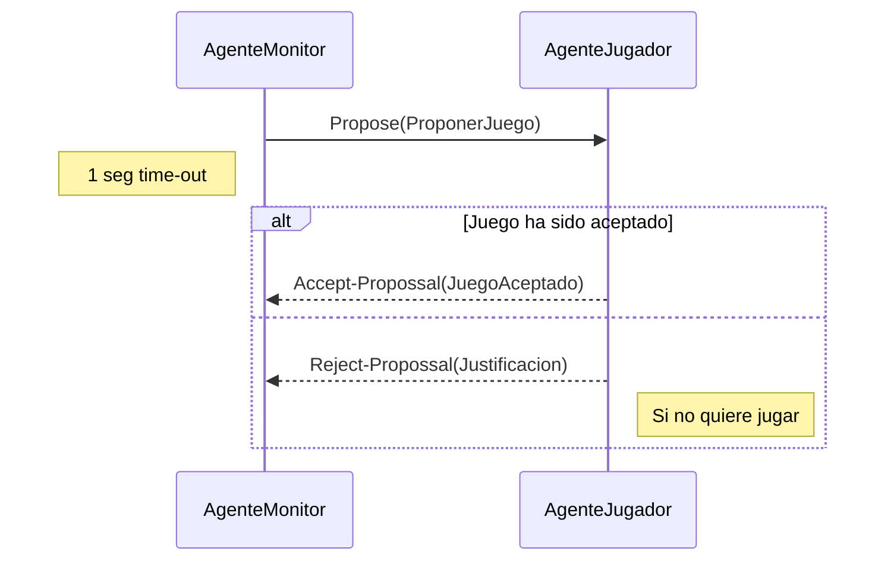
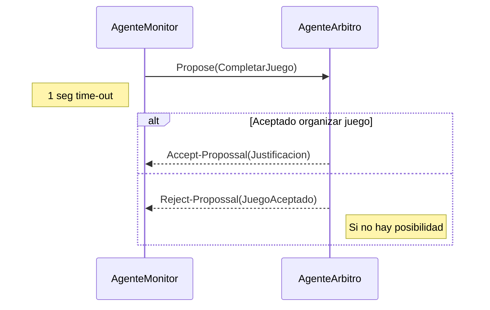
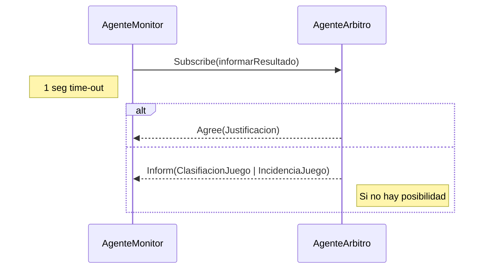
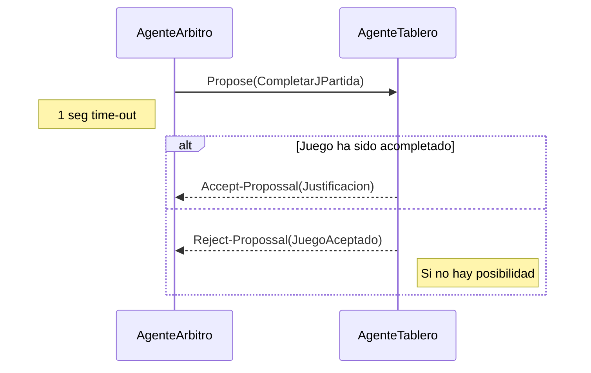
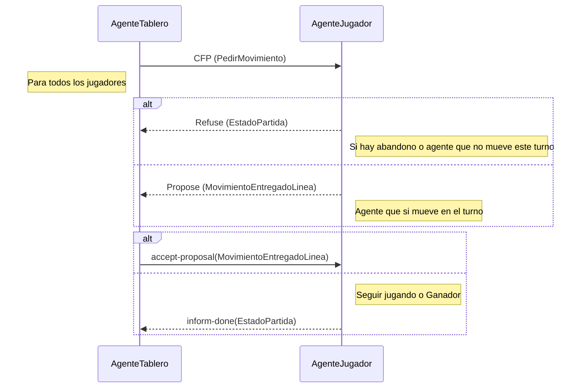
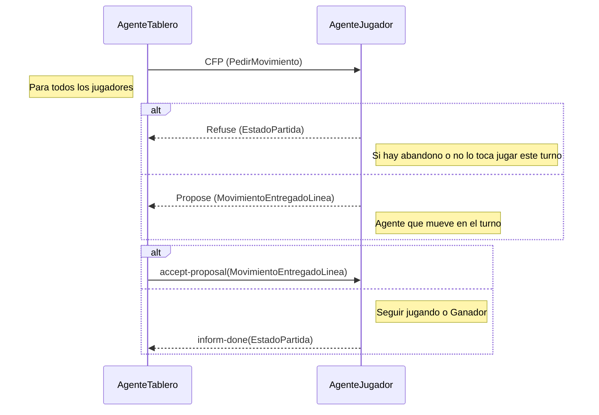
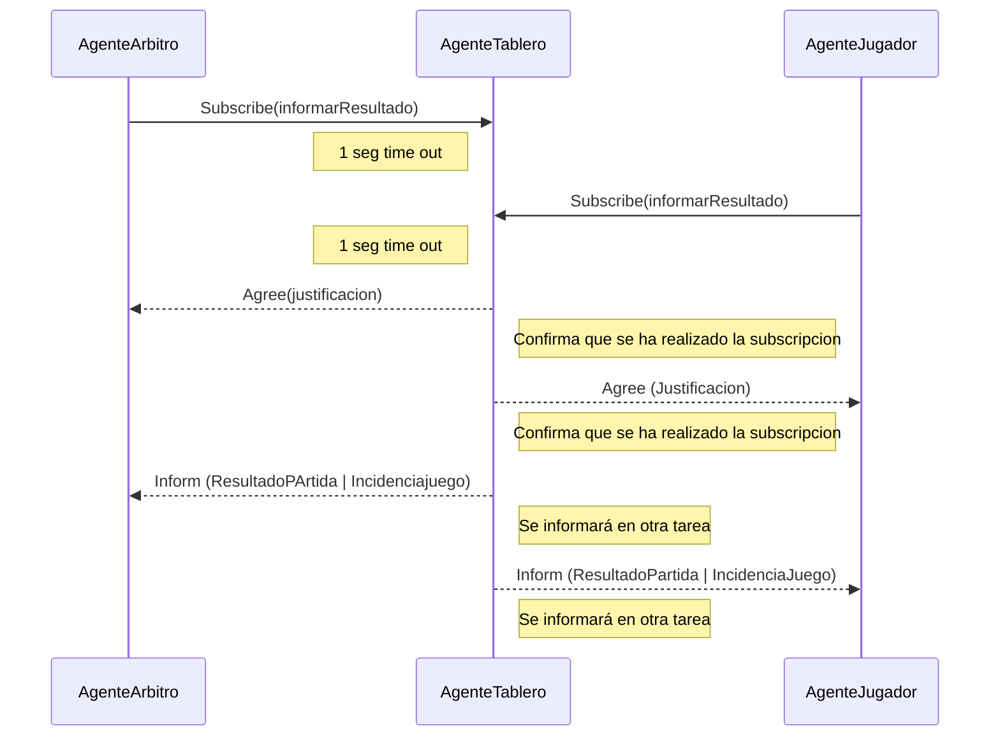
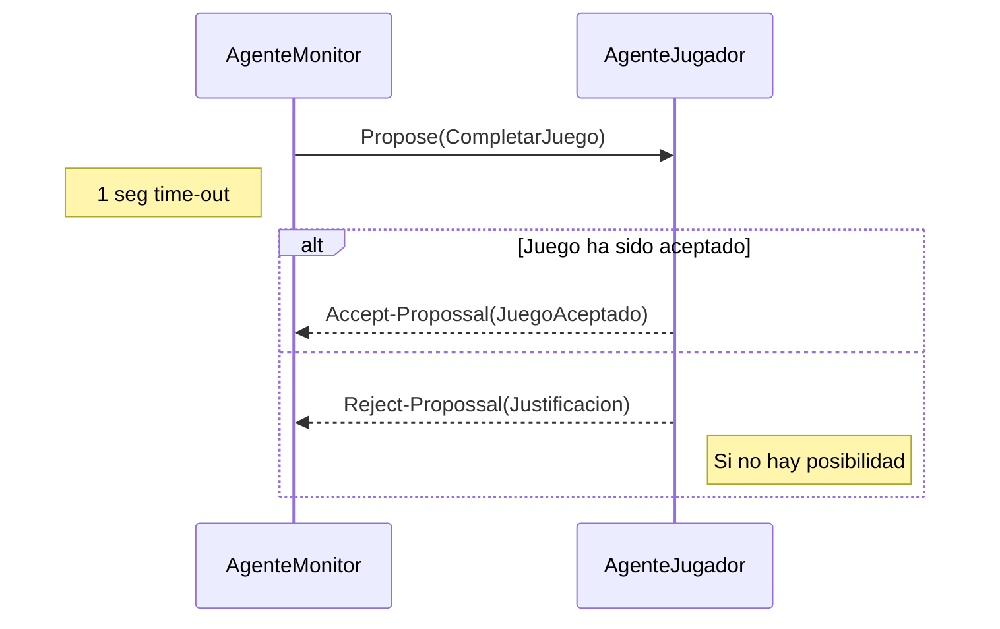
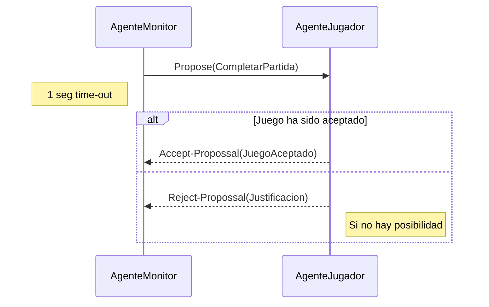

  

# Práctica 4 . Ontologías Juegos de mesa

  
## Objetivo
Esta práctica de la asignatura de Sistemas Multiagente tiene como objetivo una primera toma de contacto con el analisis de las ontologías y su aplicación práctica en juegos de tablero reales. 
El diseño de las ontologías estará pensado para resolver las necesidades de comunicación de los agentes implicados en las prácticas. Estos agentes estarán diseñados para responder a los eventos necesarios para:

- Localizar a los agentes especializados:
    
    - Agentes que se encargan de completar los juegos y presentar una representación del juego.
    - Agentes organizadores que distribuyen los juegos para que los agentes especializados en el juego puedan completarlo.
    - Agentes jugadores para uno o varios juegos. Los agentes que se diseñen para los diferentes juegos se suponen que juegan correctamente, es decir, no tienen la posibilidad para _hacer trampa_.
    
- Realizar las tareas necesarias para los diferentes juegos:

    - Recopilar a los agentes jugadores que estén dispuestos a jugar una partida o un torneo.
    - Completar los turnos necesarios para una partida individual entre dos agentes jugadores.
    - Comunicar el resultado de las diferentes partidas.
  
En nuestro caso, vamos a diseñar las ontologías para los siguientes juegos: 
1. [BackGammon](https://www.youtube.com/watch?v=peTdgXYeQKg)
2. [Parchís](https://www.youtube.com/watch?v=zyB784dKiBM)
3. [Escalera](https://www.youtube.com/watch?v=ncYhKhGsQwc)
4. [Gatos y raton](https://www.youtube.com/watch?v=Eo_UdPnwTno)

Como el diseño de las ontologías estará enfocado en resolver las necesidades de comunicación entre los agentes se incluirán los diagramas UML para los diferentes protocolos de comunicación entre **agentes-FIPA** que las resuelven.
  
## 1. Análisis de la ontología
---
Nuestra ontología debe responder apropiadamente a las siguientes preguntas:

1. ¿Cómo diferenciar a los diferentes agentes especializados?
2. ¿Cómo proponer a los diferentes jugadores que participen en un juego?
3. ¿Cómo debe completarse un juego ?
4. ¿Cómo obtener el resultado del juego propuesto?
5. ¿Cómo generar las partidas que componen un juego?
6. ¿Cómo completar un turno de una partida? ¿Cómo completar la partida?
7. ¿Cómo informar del resultado final de la partida?

Estas preguntas van a necesitar que se intercambie información entre los agentes de la plataforma. Para resolver las diferentes preguntas se presentan los diagramas UML para la secuencia de mensajes que deben intercambiarse entre los agentes implicados.

##### 1.1 ¿Cómo diferenciar a los diferentes agentes especializados?
Para resolver esta pregunta utilizaremos la utilidad del servicio de páginas amarillas que nos proporciona la plataforma de **agentes-FIPA**. De esta forma no será necesario tener elementos en la ontología para poder resolver el problema de comunicación pero sí será necesario un elemento en el vocabulario para que los agentes puedan subscribirse en el servicio de páginas amarillas de forma homogénea:

`TipoServicio` : Los agentes especializados tendrán asociado un tipo de servicio y utilizan este elemento del vocabulario. Los agentes especializados serán:

- `JUGADOR` : Representa el tipo de servicio para cualquier agente jugador de alguno de los tipos de juegos representados en la ontología.
- `TABLERO` : Representa el tipo de servicio que mantiene el estado del juego y responde a las consultas de los otros agentes sobre el estado del juego. 
- `ARBRITO` : Representa el tipo de servicio que proporcionan los agentes que se encargarán de la organización de las partidas que representan un juego. Supervisa el juego y aplica las reglas del juego. 

`TipoJuego` : Representa a los tipos de juegos representados en la ontología y que formará parte del nombre del servicio del agente y también forma parte del vocabulario.

- ``[BackGammon | Parchis | Escalera | Gatos y raton]`` 

Hay un agente especializado que será el encargado en localizar a todos los agentes especializados. Este agente es `AgenteMonitor` y que deberá conocer todos los elementos de la ontología y será desarrollado por el profesor de la asignatura.


Los agentes tienen unos parámetros y unos objetivos que deben alcanzar antes de finalizar.

##### 1.2 ¿Cómo proponer a los diferentes jugadores que participen en un juego?

El `AgenteMonitor` propondrá un juego, de alguno de los tipos que conoce, a los `AgenteJugador` para ese tipo de juego. El juego debe identificarse de forma unívoca y los jugadores pueden tomar su decisión para participar en el juego atendiendo a su estado actual.



En el diagrama se presentan los elementos de la ontología que deberán formar parte del contenido del mensaje que se envía al agente. Los elementos de la ontología tendrán los siguientes atributos:

- `ProponerJuego` : Tiene la información necesaria para que los agentes puedan tomar su decisión
	- `Juego` : representa al juego en el que debe participar el jugador.
		- `idJuego` : identificará de forma unívoca el juego.
		- `TipoJuego` : ``[BackGammon | Parchis | Escalera | Gatos y raton]`` uno de los tipos de juego disponibles en la ontología.
	- `Modo` : ``[UNICO | ELIMINATORIA | TORNEO]`` desarrollo del juego. Esto determina en el número de partidas que deberá completar cada jugador en el juego.
	
	 - `InfoJuego` : es un concepto abstracto que permite representar los datos necesarios de un juego. De esta forma se extender la ontología con nuevos tipos de juegos.
		- `BackGammon` : los atributos necesarios para el juego del BackGammon.
			- `Tablero` : dimensiones del tablero para un juego de BackGammon, que seria el numero de casillas .
		- `Parchis` : los atributos necesarios para el juego Parchís.
			- `Tablero` : dimensiones del tablero para un juego de Parchís, que seria el número de casillas.
			- `numJugadores` : número de jugadores para el juego.
		- `Escalera` : los atributos necesarios para el juego Escalera.
			- `Tablero` : dimensiones del tablero para un juego Escalera.
			- `numJugadores` : número de jugadores para el juego.
			- `numEscaleras`: numero de escaleras para el juego
			- `numSerpientes`: numero de serpientes
		- `Gatos y raton` : los atributos necesarios para un juego Gatos y ratón 
			- `Tablero` : dimensiones del tablero para un juego Escalera.

- `Justificacion` : Es un elemento del vocabulario y contendrá las posibilidades que dispone el agente para indicar el rechazo para participar en el juego.
	-  `Juego` : representa el juego en el que no se desea participar.
	- `Motivo` : justificación para no participar en el juego. Los posibles motivos estarán recogidos en el vocabulario:

```
JUEGOS_ACTIVOS_SUPERADOS | PARTICIPACION_EN_JUEGOS_SUPERADA | 
TIPO_JUEGO_NO_IMPLEMENTADO | DEMASIADOS_JUEGOS_SIN_COMPLETAR | SUPERADO_LIMITE_PARTIDAS 
| SUBSCRIPCION_ACEPTADA | ERROR_SUBSCRIPCION | ERROR_CANCELACION | ONTOLOGIA_DESCONOCIDA
```

- `JuegoAceptado` : Permite al agente indicar que desea participar en el juego. Ya sea como jugador u organizador.
	- `Juego` : representa el juego en el que desea participar el agente. 
	- `AgenteJugador` : representa al agente especializado que desea participar en el juego. Es un concepto abstracto que permite representar a los agentes especializados y así poder extender la ontología para atender la posibilidad que se añadan más agentes especializados.

##### 1.3 ¿Cómo debe completarse un juego ?

Cuando el `AgenteMonitor` ha localizado jugadores que están dispuestos a participar en un juego hay que localizar a un `AgenteÁrbitro` que se encargue de generar las partidas necesarias para completar ese juego.


En el diagrama se presentan los elementos de la ontología que deberán formar parte del contenido del mensaje que se envía al agente. Los elementos de la ontología tendrán los siguientes atributos:

- `CompletarJuego` : Tiene la información necesaria para generar las partidas individuales que permitan completar el juego propuesto.
    - `Juego` : juego que se debe completar.
    - `Modo` : ``[UNICO | ELIMINATORIA | TORNEO]`` desarrollo del juego. Esto determina en el número de partidas que deberá completar cada jugador en el juego.
    - `InfoJuego` : es un concepto abstracto que permite representar los datos necesarios de un juego. De esta forma se extender la ontología con nuevos tipos de juegos.
    - `ListaJugadores` : es una colección de elementos `Jugador`, y al menos deben ser dos, que participarán en las partidas que definen el juego.

Los otros elementos de la ontología ya han sido descritos en el punto anterior.

##### 1.4 ¿Cómo obtener el resultado del juego propuesto ?
Para que el `AgenteMonitor` pueda recibir la información del resultado de los juegos que proponga a diferentes `AgenteArbitro` será necesario el siguiente intercambio de mensajes:



En el diagrama se presentan los elementos de la ontología que deberán formar parte del contenido del mensaje que se envía al agente. Los elementos de la ontología tendrán los siguientes atributos:

- `InformarResultado` : Representa la información del agente que quiere recibir la información del resultado del juego
	- `AgenteJugador` : representa al agente especializado que desea recibir la información. Es un concepto abstracto que permite representar a los agentes especializados y así poder extender la ontología para atender la posibilidad que se añadan más agentes especializados.

- `SubInform` : Elemento abstracto para representar las posibilidades de información que puede recibir el agente especializado. En este caso los valores pueden ser:
	-  ``[ClasificacionJuego | IncidenciaJuego ]`` contempla las posibilidades de finalización de un juego.

- `ClasificacionJuego` : Si el juego ha finalizado correctamente se envía la información relativa a la clasificación del juego con los jugadores implicados.
	- `Juego` : representa el juego que ha finalizado.
	- `ListaJugadores` : colección de elementos `Jugador` que han participado en el juego ordenados desde el campeón en adelante.
	- `ListaPuntuacion` : colección con los puntos obtenidos por cada uno de los jugadores de la lista anterior. 

- `IncidenciaJuego` : si la partida no finaliza de forma normal este elemento indicará el motivo
	- ``[CANCELADO, JUGADORES_INSUFICIENTES]`` posibles valores recogidos en el vocabulario para una finalización incompleta del juego.

##### 1.5 ¿Cómo generar las partidas que componen un juego ?

El `AgenteArbitro` se encarga de ir generando las rondas necesarias para completar el juego. El número de rondas dependerá del atributo `Modo` del elemento `CompletarJuego`. En cada ronda se generan un número de partidas que deben ser completadas por el `AgenteTablero`.





##### 1.6 ¿Como completar un turno de una partida ?¿Como completar la partida?

El `AgenteTablero` es el encargado de organizar los turnos que componen una partida. De esta forma lo importante es identificar los elementos de información necesarios para completar un turno de juego. 

Para completar un turno de juego se envía el mismo mensaje a los todos los jugadores que forman parte de la partida. La información necesaria depende del tipo de juego.

Para completar una partida, bastaría con repetir las veces que sean necesarias el esquema de un turno, hasta encontrar un ganador o un empate.


**Parchís y Backgammon**



En el diagrama se presentan los elementos de la ontología que deberán formar parte del contenido del mensaje que se envía al agente. Los elementos de la ontología tendrán los siguientes atributos:

- `TiradaDado`: estos juegos necesitan tirar uno o varios dados para calcular el movimiento
	- `NumeroMovimientos`: cuantas casillas se podrá mover la ficha

- `PedirMovimiento` : Información necesaria para completar el turno de juego.
    - `Partida` : partida a la que corresponde el turno.
    - `Jugador` : jugador que tiene que realizar el movimiento, **jugador activo**.

- `EstadoPartida` : Información sobre posibles contingencias que pueden ocurrir durante la partida.
    - `Partida` : partida a la que corresponde el turno.
    - `Estado` : posibles estados en los que se puede encontrar la partida. Sus valores están definidos en el vocabulario.
        - ``[GANADOR | ABANDONO | SEGUIR_JUGANDO | FIN_PARTIDA | JUGADOR_NO_ACTIVO]``

- `MovimientoEntregado` : Información del movimiento que realiza el jugador activo del turno. 
    - `Partida` : partida a la que corresponde el turno.
    - `Movimiento` : un movimiento válido, suponemos que los jugadores juegan correctamente.
        - `FichaJuego` : elemento abstracto que permite representar las posibles fichas de un juego.
        - `Posicion` : localización de la ficha en el tablero.
            - `Numero_casilla`: numero de casilla en el array de casillas

- `FichaJuego` 
	- `Ficha_Parchis` : ficha para los juegos
		- `Jugador` : jugador asociado a la ficha
		- `Color` : ``[ ROJO | AZUL | VERDE | AMARILLO ]`` una de las posibilidades definidas en el vocabulario de la ontología.
	- `Ficha_Backgammon` : ficha para los juegos
		- `Jugador` : jugador asociado a la ficha
		- `Color` : ``[ NEGRO | BLANCO]`` una de las posibilidades definidas en el vocabulario de la ontología.
	
	


**Gatos y ratón  y Escalera :**



En el diagrama se presentan los elementos de la ontología que deberán formar parte del contenido del mensaje que se envía al agente. Los elementos de la ontología tendrán los siguientes atributos:

- `TiradaDado_Escalera`: estos juegos necesitan tirar uno o varios dados para calcular el movimiento
	- `NumeroMovimientos`: cuantas casillas se podrá mover la ficha

- `PedirMovimiento` : Información necesaria para completar el turno de juego.
    - `Partida` : partida a la que corresponde el turno.
    - `Jugador` : jugador que tiene que realizar el movimiento, **jugador activo**.

- `EstadoPartida` : Información sobre posibles contingencias que pueden ocurrir durante la partida.
    - `Partida` : partida a la que corresponde el turno.
    - `Estado` : posibles estados en los que se puede encontrar la partida. Sus valores están definidos en el vocabulario.
        - ``[GANADOR | ABANDONO | SEGUIR_JUGANDO | FIN_PARTIDA | JUGADOR_NO_ACTIVO]``

- `MovimientoEntregado` : Información del movimiento que realiza el jugador activo del turno. 
    - `Partida` : partida a la que corresponde el turno.
    - `Movimiento` : un movimiento válido, suponemos que los jugadores juegan correctamente.
        - `FichaJuego` : elemento abstracto que permite representar las posibles fichas de un juego.
        - `Posicion` : localización de la ficha en el tablero.
            - (`Fila` , `Columna`)

- `FichaJuego` 
	- `Ficha_Escalera` : ficha para los juegos
		- `Jugador` : jugador asociado a la ficha
		- `Color` : ``[ ROJO | AZUL | VERDE | AMARILLO ]`` una de las posibilidades definidas en el vocabulario de la ontología.
	- `Ficha_GatosyRaton` : ficha para los juegos
		- `Jugador` : jugador asociado a la ficha
		- `Color` : ``[ NEGRO | BLANCO]`` una de las posibilidades definidas en el vocabulario de la ontología.
	

##### 1.7 ¿Como informar del resultado de la partida?
Un `AgenteArbitro` o  `AgenteJugador` que participe en partidas dirigidas por un `AgenteTablero` necesita conocer el resultado de las partidas que el `AgenteTablero` completo. La información que remite el `AgenteTablero` debe identificar el agente que la solicita para reciba solo las partidas en las que está implicado.



En el diagrama se presentan los elementos de la ontología que deberán formar parte del contenido del mensaje que se envía al agente. En la **sección 1.4** ya se han presentado los elementos de la ontología que son necesarios. En este punto solo hay que especificar los siguientes elementos:

- `SubInform` : Elemento abstracto para representar las posibilidades de información que puede recibir el agente especializado. En este caso los valores pueden ser:
    
    - ``[ ResultadoPartida | IncidenciaJuego]``contempla las posibilidades de finalización de la partida.

- `ResultadoPartida` : Representa el resultado de la partida.
    - `Partida` : datos de la partida que se ha completado.
    - `Jugador` : representa al ganador de la partida. Si no hay ganador se incluirá un `Jugador`vacío, esto es, `new Jugador("",new AID())`.

El **Agente Árbitro** supervisa el juego y aplica las reglas del juego. El Agente Árbitro valida los movimientos propuestos por el Agente Jugador, determina cuándo es el turno de cada jugador, y determina cuándo el juego ha terminado y quién es el ganador.


### 2. Diseño de la ontología
---
En la sección anterior se han presentado todos los elementos y relaciones que se presentan en la ontología necesaria para completar los juegos propuesto. Para el diseño de la ontología se tendrá presente su implementación con las capacidades que nos proporciona la biblioteca de agentes [Jade](https://jade.tilab.com/doc/api/jade/content/package-frame.html). De esta forma se presentarán unos diagramas de clase donde se muestran las relaciones entre ellas. Se presentan dos diagramas atendiendo a los elementos:

- `Concept` : Elementos que representan la información necesaria para representar los diferentes tipos de juegos de la ontología.
- `AgentAction` : Elementos que representas los eventos a los que responden los agentes para completar los juegos de la ontología.

#### 2.1 Diagrama para elementos Concept


#### 2.2 Diagrama para elementos AgenteAction


#### 2.4 Tarea para la comunicación
Como la ontología está diseñada para resolver los problemas de comunicación entre los agentes implicados en los juegos se especificarán los **protocolos FIPA** que se utilizarán.

---
**Protocolo FIPA-Propose**:

Localizar jugadores para un juego:


Crear un juego con los jugadores que aceptaron:



Completar una partida con los jugadores: 


---
**Protocolo FIPA-ContracNet** :

Tuno para los juegos Backgammon y Parchis:


Turno para el juego Gatos y ratón y Escalera: 


---
**Protocolo FIPA-Subscribe**:

Obtener la clasificacion de un juego que se haya completado:


Obtener el ganador de una partida:


---
#### 2.5 Axiomas de la ontología

No tendrán una representación en la implementación de la ontología pero sí debemos tenerlos en cuenta para una correcta utilización de la misma:

Para Escalera y Gatos y ratón:
- Origen de coordenadas para definir las posiciones en el tablero. La `Posicion(0,0)` estará localizada en la esquina superior izquierda del tablero de juego.
- Cuando se generan las posiciones del tablero:
    - La coordenada `X` : representa la fila del tablero.
    - La coordenada `Y` : representa la columna del tablero.

Para Backgammon  y Parchis:
- Las posiciones iran de 0 a n. Cada tipo de jugador empezará en una casilla diferente, y tendrá que llegar a otra diferente, pero siempre teniendo que sortear el mismo numero de casillas, aunque no sean las mimas. 


